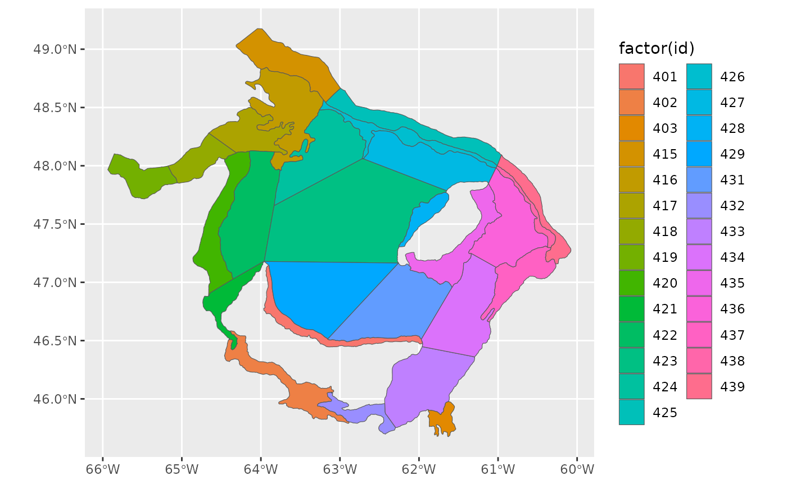
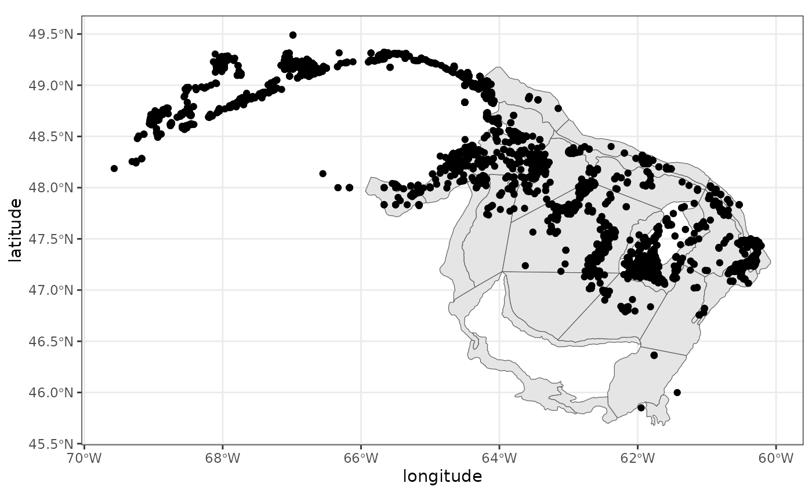
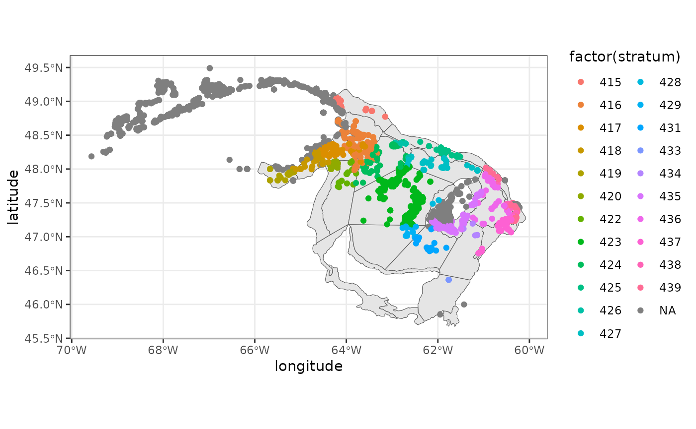
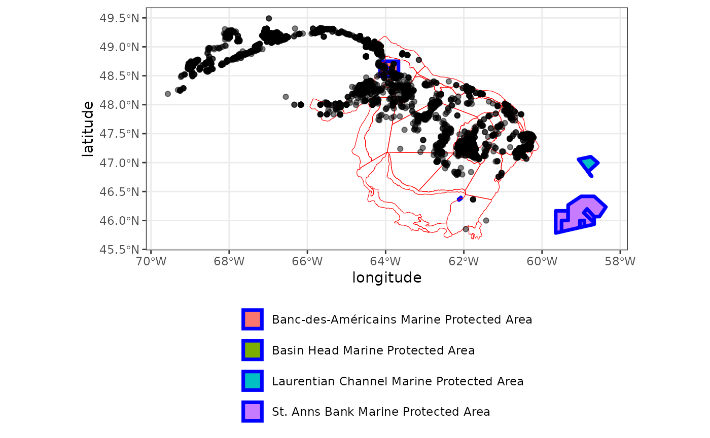
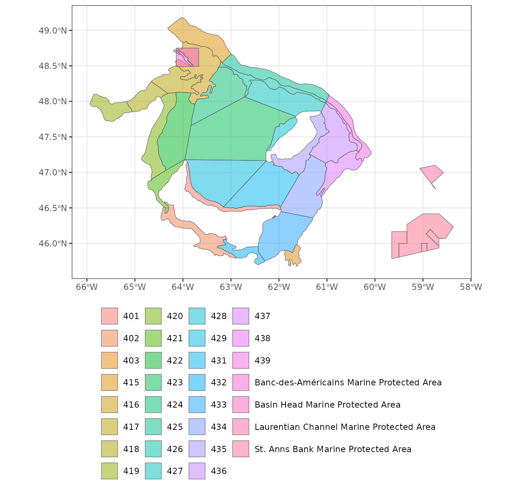
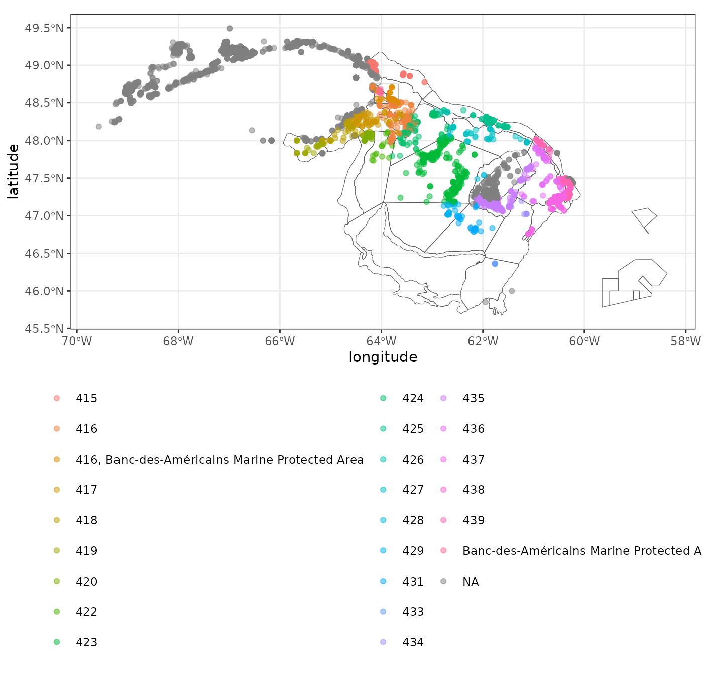
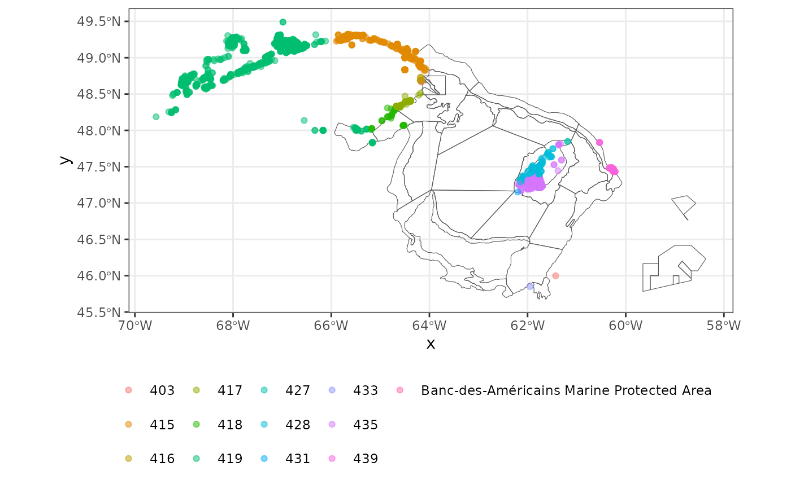

# Assigning points to polygons

There are three functions that can assign points (coordinates) to
polygons:

- **assign_points_terra** is useful when each point could overlap with
  only polygon in a shapefile
- **assign_points_secr** is useful when each point could overlap with
  one or more polygons in a shapefile. It returns a presence absence
  data frame to indicate whether a point is inside a polygon. The last
  column in the data frame indicates all the polygons associated with
  each point.
- **assign_points_to_nearest_polygon** is useful when there are points
  that don’t overlap with any polygons, but you want to know which
  polygon a point is nearest to. This function uses the edges, rather
  than the centroids, of polygons.

The examples below assign fishing coordinates to DFO September research
vessel survey strata and/or Marine Protected Areas.

``` r

library(gslSpatial)
library(ggplot2)
library(tidyterra)
```

## Get a shapefile

Notice that the coordinate reference system (crs) is lon/lat NAD83
(EPSG:4269). When working with spatial data, your data should all have
the same crs. If they don’t, you can re-project them (e.g.,
?terra::project).

``` r

rv<-get_shapefile('rv.sgsl')
#> sGSL September RV Survey

# see information about the object
rv 
#> class       : SpatVector
#> geometry    : polygons
#> dimensions  : 27, 3  (geometries, attributes)
#> extent      : -65.9368, -60.0779, 45.6756, 49.1769  (xmin, xmax, ymin, ymax)
#> coord. ref. : lon/lat NAD83 (EPSG:4269)
#> names       :    id  area trawlable.
#> type        : <int> <num>      <num>
#> values      :   401  1182      29163
#>                 402  1553      38319
#>                 403   388       9580
#>               ...

# plot it
ggplot()+
  geom_spatvector(data=rv,aes(fill=factor(id)))
```



## Get some data

This example uses commercial landings data that have longitude and
latitude coordinates with the same crs as the shapefile.

``` r

df<-dat.ziff[,c('longitude','latitude')]
head(df)
#>         longitude latitude
#> 6546100  -60.4406  47.2421
#> 6547100  -60.4581  47.2281
#> 6548100  -60.4581  47.2281
#> 6549100  -60.3503  47.3175
#> 6550100  -60.3503  47.3175
#> 6551100  -60.3258  47.2961
```

## Plot everything

There are many points inside the polygons as well as outside the
polygons

``` r


ggplot()+
  geom_spatvector(data=rv)+
  geom_point(data=df,aes(longitude,latitude))+
  theme_bw()
```



## Using function `assign_points_terra`

``` r

x<-assign_points_terra(df$longitude, df$latitude,rv)
#> Processing points 1 to 1000. 00:36:06
#> Processing points 1001 to 2000. 00:36:06
#> Processing points 2001 to 3000. 00:36:06
#> Processing points 3001 to 4000. 00:36:06
#> Processing points 4001 to 4559. 00:36:06
head(x)
#>          x       y assigned.polygon
#> 1 -60.4406 47.2421              437
#> 2 -60.4581 47.2281              437
#> 3 -60.4581 47.2281              437
#> 4 -60.3503 47.3175              438
#> 5 -60.3503 47.3175              438
#> 6 -60.3258 47.2961              439

stratum<-x[,3]

# combine
df1<-cbind(df,stratum)
head(df1)
#>         longitude latitude stratum
#> 6546100  -60.4406  47.2421     437
#> 6547100  -60.4581  47.2281     437
#> 6548100  -60.4581  47.2281     437
#> 6549100  -60.3503  47.3175     438
#> 6550100  -60.3503  47.3175     438
#> 6551100  -60.3258  47.2961     439

ggplot()+
  geom_spatvector(data=rv)+
  geom_point(data=df1,aes(longitude,latitude,col=factor(stratum)))+
  theme_bw()
```



## What if there are overlapping polyons? Use function `assign_points_secr`

If there are overlapping polygons causing your data points to ‘belong’
to multiple polygons, you can use function `assign_points_secr`

Start by getting another shapefile. This example uses Oceans Act Marine
Protected Areas

``` r

mpa<-get_shapefile('mpa')

mpa
#> class       : SpatVector
#> geometry    : polygons
#> dimensions  : 11, 12  (geometries, attributes)
#> extent      : -64.14, -58.3667, 45.7833, 48.75004  (xmin, xmax, ymin, ymax)
#> coord. ref. : lon/lat NAD83 (EPSG:4269)
#> names       : OBJECTID          NAME_E          NAME_F ZONE_E ZONE_F           URL_E           URL_F      REGULATION       REGLEMENT   KM2 Shape_Leng  Shape_Area
#> type        :    <int>           <chr>           <chr>  <chr>  <chr>           <chr>           <chr>           <chr>           <chr> <num>      <num>       <num>
#> values      :        1 Basin Head Mar~ Zone de protec~ Zone 3 Zone 3 http://www.dfo~ http://www.dfo~ http://laws.ju~ http://laws.ju~  8.64    15192.6 8.64204e+06
#>                      2 Basin Head Mar~ Zone de protec~ Zone 1 Zone 1 http://www.dfo~ http://www.dfo~ http://laws.ju~ http://laws.ju~  0.24    6509.81      241573
#>                      3 Basin Head Mar~ Zone de protec~ Zone 2 Zone 2 http://www.dfo~ http://www.dfo~ http://laws.ju~ http://laws.ju~  0.35    5975.78      354147
#>               ...

ggplot()+
  geom_spatvector(data=mpa,aes(fill=factor(NAME_E)),col='blue',lwd=1.25)+
  geom_spatvector(data=rv,fill=NA,col='red')+
  geom_point(data=dat.ziff,aes(longitude,latitude),alpha=0.5)+
  theme_bw()+
  theme(legend.position="bottom",legend.title=element_blank())+
  guides(fill=guide_legend(ncol=1,byrow=TRUE))
```



In order to demonstrate function `assign_points_secr`, we will combine
the two shapefiles as if they were originally a single shapefile.

``` r

library('terra')

# first need to make names match
names(rv)
#> [1] "id"         "area"       "trawlable."
names(mpa)
#>  [1] "OBJECTID"   "NAME_E"     "NAME_F"     "ZONE_E"     "ZONE_F"    
#>  [6] "URL_E"      "URL_F"      "REGULATION" "REGLEMENT"  "KM2"       
#> [11] "Shape_Leng" "Shape_Area"

rv$NAME<-as.character(rv$id)
mpa$NAME<-as.character(mpa$NAME_E)

shape<-rbind(rv,mpa)
shape<-shape[, c("NAME")]
shape
#> class       : SpatVector
#> geometry    : polygons
#> dimensions  : 38, 1  (geometries, attributes)
#> extent      : -65.9368, -58.3667, 45.6756, 49.1769  (xmin, xmax, ymin, ymax)
#> coord. ref. : lon/lat NAD83 (EPSG:4269)
#> names       :  NAME
#> type        : <chr>
#> values      :   401
#>                 402
#>                 403
#>               ...
```

``` r

ggplot()+
  geom_spatvector(data=shape,aes(fill=factor(NAME)),alpha=0.5)+
  theme_bw()+
  theme(legend.position="bottom",legend.title=element_blank())+
  guides(fill=guide_legend(nrow=8))
```



Now use function `assign_points_secr`

``` r

x<-assign_points_secr(dat.ziff[,'longitude'],
                        dat.ziff[,'latitude'],
                        shape,"NAME")
#> Processing points 1 to 1000. 00:36:09
#> Processing points 1001 to 2000. 00:36:10
#> Processing points 2001 to 3000. 00:36:10
#> Processing points 3001 to 4000. 00:36:11
#> Processing points 4001 to 4559. 00:36:11

polygon<-x$assigned.polygon

df2<-cbind(dat.ziff,polygon)
```

Using function `table` shows that 69 points fall within the area in
which stratum 416 overlaps with Banc-des-Américains Marine Protected
Area. All other assigned points belong to non-overlapping polygon areas.

``` r

rbind(table(df2$polygon))
#>      415 416 416, Banc-des-Américains Marine Protected Area 417 418 419 420 422
#> [1,] 105 111                                             69  92  77  28  31  15
#>      423 424 425 426 427 428 429 431 433 434 435 436 437 438 439
#> [1,] 264  64 198   7  43   3  33  37   4   6 236  61 302  49 177
#>      Banc-des-Américains Marine Protected Area
#> [1,]                                        15

ggplot()+
  geom_spatvector(data=shape,fill=NA)+
  geom_point(data=df2,aes(longitude,latitude,col=polygon),alpha=0.5)+
  theme_bw()+
  theme(legend.position="bottom",legend.title=element_blank())+
  guides(col=guide_legend(ncol=3))
```



## Assigning points to the nearest polygon

Finally, the previous examples show that a number of data points don’t
overlap with any of the polygons in our shapefiles. But what if we
wanted to find out which polygons they were closest to? Then we could
use function `assign_points_to_nearest_polygon`. This function takes a
bit longer to run compared to `assign_points_terra` or
`assign_points_secr`.

``` r

# get the unassigned data points
pts.outside<-df2[which(is.na(df2$polygon)),]

x<-assign_points_to_nearest_polygon(pts.outside$longitude, pts.outside$latitude, shape, 'NAME')

head(x)
#>          x       y NAME n$distance
#> 1 -60.2833 47.4666  439  1649.2764
#> 2 -60.3000 47.4666  439   944.1621
#> 3 -60.3000 47.4666  439   944.1621
#> 4 -60.2833 47.4833  439  3034.2767
#> 5 -60.3166 47.4833  439  1080.0245
#> 6 -60.2833 47.4833  439  3034.2767

ggplot()+
  geom_spatvector(data=shape,fill=NA)+
  geom_point(data=x,aes(x,y,col=NAME),alpha=0.5)+
  theme_bw()+
  theme(legend.position="bottom",legend.title=element_blank())+
  guides(col=guide_legend(ncol=6))
```


