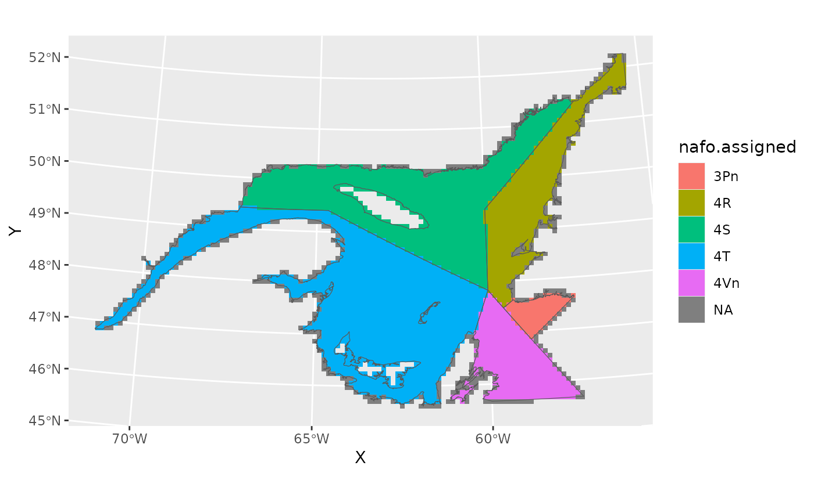
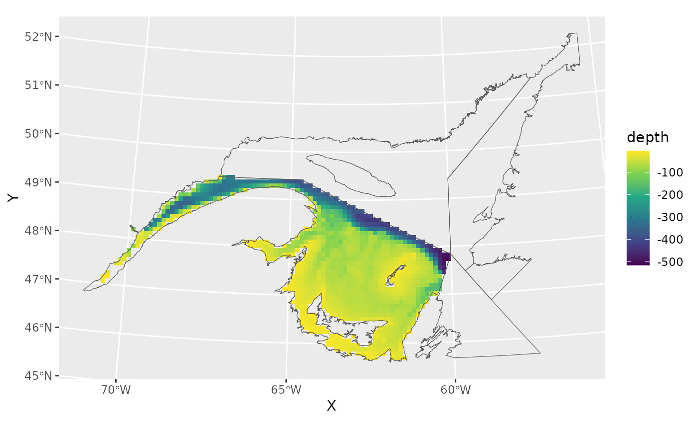
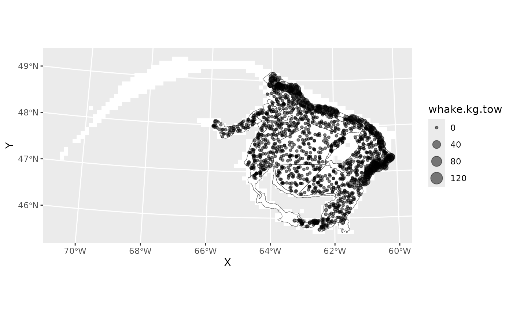
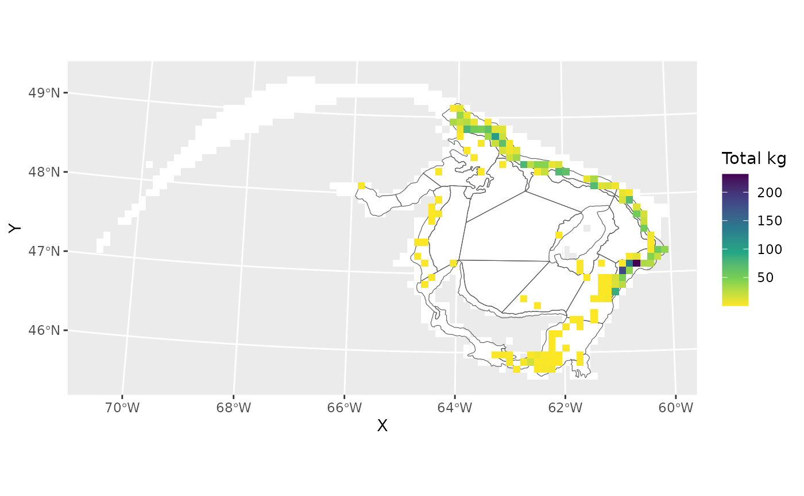

# Working with raster objects

## Objectives

1.  Make square 10 km X 10 km grid cells over the GSL
2.  Summarise sGSL Research Vessel catch data
3.  Get the results as either a data frame or a SpatRaster

``` r

library(gslSpatial)
library(ggplot2)
library(terra)
library(tidyterra)
```

## Make square grids

Use the `make_grid` function, specifying the grid cell size
(resolution). Using a resolution of 10 makes each grid cell 10 km X 10
km. The finer the resolution, the longer it will take to generate. By
default, this function generates grid cells spanning all of NAFO
3Pn4RSTVn, and assigns the corresponding NAFO division or subdivision to
each cell.

``` r

grid<-make_grid(10)
#> Source: https://www.nafo.int
#> Assigning NAFO divisions to 3141 grid cells.
#> Processing points 1 to 1000. 00:36:40
#> Processing points 1001 to 2000. 00:36:50
#> Processing points 2001 to 3000. 00:37:03
#> Processing points 3001 to 3141. 00:37:11
```

The resulting grid is a data frame. The coordinates are the centers of
the grid cells. Longitude and latitude coordinates are NAD83, EPSG:4269,
in decimal degrees. X and Y coordinates are NAD83, UTM zone 20N, with
units in km.

``` r

class(grid)
#> [1] "data.frame"
head(grid)
#>             X        Y area longitude latitude nafo.assigned
#> 112  988.9978 5810.911    1 -55.83546 52.23061          <NA>
#> 113  998.9978 5810.911   41 -55.69022 52.22166          <NA>
#> 114 1008.9978 5810.911   92 -55.54506 52.21253            4R
#> 115 1018.9978 5810.911   32 -55.39998 52.20322          <NA>
#> 228  998.9978 5800.911   48 -55.70491 52.13248            4R
#> 229 1008.9978 5800.911  100 -55.56003 52.12338            4R
```

### Plot the grid, showing the NAFO boundaries.

Notice that grid cells without assigned NAFO divisions have centers that
fall outside the NAFO borders.

``` r

# get NAFO boundaries
naf<-get_shapefile('nafo.clipped')
#> Source: https://www.nafo.int
naf<-terra::project(naf, '+proj=utm +zone=20 +datum=NAD83 +units=km +no_defs')

ggplot()+
  geom_tile(data=grid,aes(X,Y,fill=nafo.assigned))+
  geom_spatvector(data=naf,fill=NA)
```



### Restrict by location and depth

- Restrict to NAFO 4T
- Use function `get_depth` to estimate depth in meters. Use
  ?gslSpatial::get_depth for details.
- Remove grid cells with depths shallower than 5 meters.

``` r

grid<-grid[which(grid$nafo.assigned=="4T"),]

depth<-get_depth(grid$longitude,grid$latitude,"epsg:4269")
#> Assigning depths based on GEBCO_2024, www.gebco.net.
grid$depth<-unlist(depth)
str(grid)
#> 'data.frame':    1169 obs. of  7 variables:
#>  $ X            : num  189 199 209 219 159 ...
#>  $ Y            : num  5481 5481 5481 5481 5471 ...
#>  $ area         : num  63 100 100 100 61 69 68 100 100 100 ...
#>  $ longitude    : num  -67.3 -67.1 -67 -66.9 -67.7 ...
#>  $ latitude     : num  49.4 49.4 49.4 49.4 49.3 ...
#>  $ nafo.assigned: chr  "4T" "4T" "4T" "4T" ...
#>  $ depth        : num  -11 -185 -290 -296 -36 ...

grid<-grid[-which(grid$depth>(-5)),]

ggplot()+
  geom_tile(data=grid,aes(X,Y,fill=depth))+
  geom_spatvector(data=naf,fill=NA)+
  scale_fill_viridis_c()
```



## Get catch data

This example uses sGSL September Research Vessel catch densities
(kg/tow) of white hake (‘whake.kg.tow’). The data set includes spatial
coordinates in UTM as well as lat/lon. The coordinate reference system
of the ‘X’ and ‘Y’ columns is UTM NAD83, Zone:20N, Units:km. The
coordinate reference system of the ‘longitude’ and ‘latitude’ columns is
NAD83, EPSG:4269, decimal degrees.

``` r

dat<-dat.rv[,1:7]
head(dat)
#>           X        Y longitude latitude year   depth whake.kg.tow
#> 6  313.8402 5308.708 -65.49108 47.90467 2018 52.5536            0
#> 7  290.4235 5317.821 -65.80850 47.97933 2019 31.7084            0
#> 8  288.4847 5329.066 -65.84000 48.07975 2020 26.9360            0
#> 9  306.6000 5291.646 -65.58025 47.74917 2021 29.2280            0
#> 10 288.8187 5322.182 -65.83213 48.01800 2022 30.7900            0
#> 42 350.8052 5323.713 -65.00200 48.04925 2018 64.1984            0
```

### Plot raw data

This figure also shows the sGSL September Reearch Vessel survey strata.

``` r

rv<-get_shapefile('rv.sgsl')
#> sGSL September RV Survey
rv<-terra::project(rv,naf)

ggplot()+
  geom_tile(data=grid,aes(X,Y),fill='white')+
  geom_spatvector(data=rv,fill=NA)+
  geom_point(data=dat,aes(X,Y,size=whake.kg.tow),alpha=0.5)
```



## Summarise

``` r

x<-aggregate_raster(dat,"whake.kg.tow",sum,grid,out='df')
names(x)[ncol(x)]<-'sum.hake'
head(x)
#>            X        Y  sum.hake
#> 375 418.9978 5440.911  1.833807
#> 376 428.9978 5440.911  8.968344
#> 457 428.9978 5430.911 37.424866
#> 458 438.9978 5430.911  7.786280
#> 537 418.9978 5420.911 30.566967
#> 538 428.9978 5420.911 22.716385
summary(x$sum.hake)
#>    Min. 1st Qu.  Median    Mean 3rd Qu.    Max. 
#>   0.000   0.000   0.000   4.466   0.000 231.762
```

### Plot

The coloured grid cells show where white hake was caught, with the
colour representing the total amoung of white hake that was caught.

``` r

ggplot()+
  geom_tile(data=grid,aes(X,Y),fill='white')+
  geom_spatvector(data=rv,fill=NA)+
  geom_tile(data=x[which(x$sum.hake>0),],
            aes(X,Y,fill=sum.hake))+
  scale_fill_viridis_c(direction=-1,
                       name="Total kg")
```



### Alternatively, summarise to a SpatRaster

``` r

x2<-aggregate_raster(dat,"whake.kg.tow",sum,grid)
crs(x2)<-crs(naf)
names(x2)[2]<-'sum.hake'
x2
#> class       : SpatRaster
#> size        : 43, 81, 2  (nrow, ncol, nlyr)
#> resolution  : 10, 10  (x, y)
#> extent      : -86.00223, 723.9978, 5055.911, 5485.911  (xmin, xmax, ymin, ymax)
#> coord. ref. : +proj=utm +zone=20 +datum=NAD83 +units=km +no_defs
#> source(s)   : memory
#> names       :   ID,   sum.hake
#> min values  :    4,          0
#> max values  : 7645, 231.762289
```
